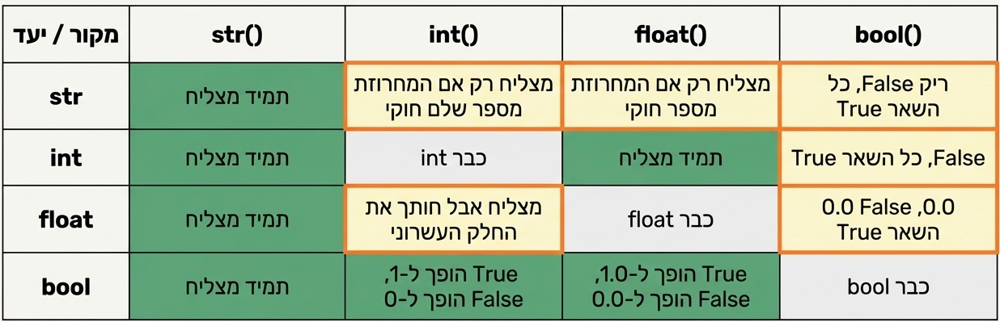

<!-- DC_HEADER_START -->
<div align="center">

🐍 **Python Learning Series | סדרת לימודי פייתון**  
**Dvir Cabessa | דביר קבסה**  
© 2025 All Rights Reserved | כל הזכויות שמורות

</div>

---
<!-- DC_HEADER_END -->

# 📘 סוגי נתונים – Data Types

## ✨ הסבר
לכל דבר שאנחנו שומרים בפייתון יש סוג – כמו ש- "מים" הם נוזל, ו "אבן" היא מוצק.  

בפייתון, יש המון סוגים שונים: מספרים, טקסט, בוליאנים, רשימות ,סטים, מילונים, וטאפלים הם סוגים של נתונים.

אם נזהה נכון את הסוג – נוכל לעשות איתו בדיוק את התפקיד שלו. 

## 🔍 הסברים ודוגמאות

### מספרים (Integers ו-Floats)
```python
user_age = 25                # Integer שלמים
user_height = 1.75           # Float עשרונים
```

### מחרוזות (Strings) טקסט 
```python
user_name = "Dvir"           # כל דבר בין זוג גרשיים
```

### בוליאנים (Booleans)
```python
is_student = True            # אמת או שקר / False או True 
```

### בדיקת סוג הנתון
```python
print(type(user_age))        # <class 'int'>
print(type(user_height))     # <class 'float'>
print(type(user_name))       # <class 'str'>
print(type(is_student))      # <class 'bool'>
```

### לא ניתן לערבב סוגים בלי המרה - נלמד בהארכה בחומר הבא
```python
# print("Age: " + 25)        # Error!
print("Age: " + str(25))     # OK!
```

---



---
## ✅ בדוק את עצמך
0. מה הם כל סוגי המשנים?
1. מה ההבדל בין int ל-float?  
2. מה יקרה אם תנסו לחבר בין string למספר בלי להמיר?  
3. מהו הפלט של `type("hello")`?

<!-- DC_FOOTER_START -->
---

<div align="center">

✨ **Thank you for learning with Dvir Cabessa** ✨  
✨ **תודה שלמדתם עם דביר קבסה** ✨  

📘 *All Rights Reserved © Dvir Cabessa 2025*  
📘 *כל הזכויות שמורות © דביר קבסה 2025*  

🔗 *For educational purposes only – copying or distribution without permission is prohibited.*  
🔗 *החומר נועד לשימוש חינוכי בלבד — אין להעתיק או להפיץ ללא אישור.*

---

> _"Education is the art of awakening curiosity and guiding it toward creation."_  
> _"החינוך הוא אמנות המעירה את הסקרנות ומכוונת אותה ליצירה."_  
> — **Dvir Cabessa**

</div>
<!-- DC_FOOTER_END -->

